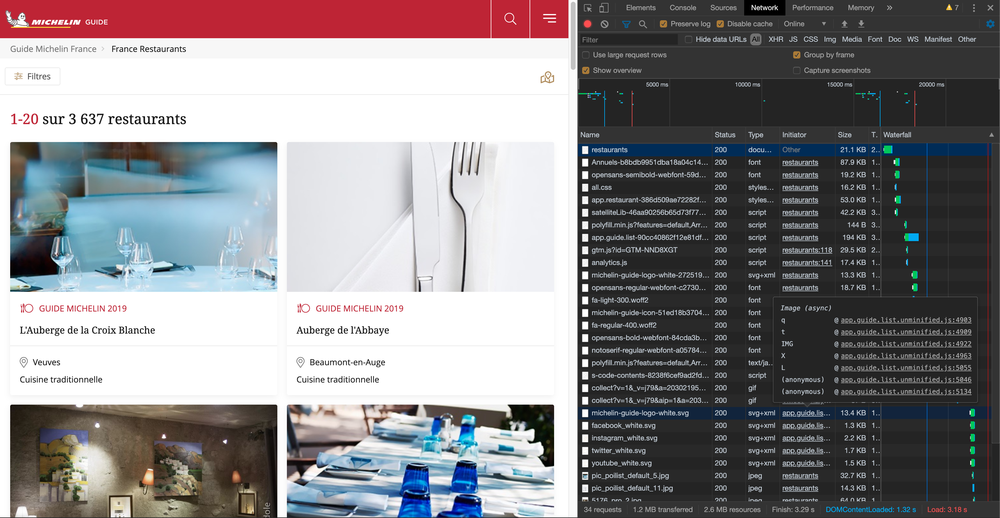

# BIB

> Maître Restaurateur x Bib Gourmand


<!-- START doctoc generated TOC please keep comment here to allow auto update -->
<!-- DON'T EDIT THIS SECTION, INSTEAD RE-RUN doctoc TO UPDATE -->
**Table of Contents**

- [🐣 Introduction](#-introduction)
- [🎯 Objectives](#-objectives)
- [🏃‍♀️ Steps to do](#%E2%80%8D-steps-to-do)
  - [Stack](#stack)
- [👩‍💻 Just tell me what to do](#%E2%80%8D-just-tell-me-what-to-do)
- [🏃‍♀️ Example of Steps to do](#%E2%80%8D-example-of-steps-to-do)
  - [Step 1. No code: Investigation first](#step-1-no-code-investigation-first)
    - [Michelin Restaurants](#michelin-restaurants)
    - [Maître-Restaurateur Restaurants](#ma%C3%AEtre-restaurateur-restaurants)
    - [The web application](#the-web-application)
  - [Step 2. Server-side with Node.js](#step-2-server-side-with-nodejs)
    - [require('michelin')](#requiremichelin)
    - [require('maitre')](#requiremaitre)
    - [require('bib')](#requirebib)
  - [Step 3. Client-side with React](#step-3-client-side-with-react)
- [📦 Suggested node modules](#-suggested-node-modules)
- [🍽 Scraping Example](#%F0%9F%8D%BD-scraping-example)
- [Don't forget](#dont-forget)
- [Licence](#licence)

<!-- END doctoc generated TOC please keep comment here to allow auto update -->

## 🐣 Introduction

## 🎯 Objectives

**List `Maître Restaurateur` with `Bib Gourmand` distinction**

## 🏃‍♀️ Steps to do

Create a connection between [maitresrestaurateurs.fr](https://www.maitresrestaurateurs.fr/), [guide.michelin.com/fr/fr/restaurants](https://guide.michelin.com/fr/fr/restaurants) and the end-user.

### Stack

```
Node.js + React + ES6
+ CSS Design Framework (bootstrap, foundation, mdl...)
[+ docker + redis ...]
```

## 👩‍💻 Just tell me what to do

1. Fork the project via `github`


1. Clone your forked repository project `https://github.com/YOUR_USERNAME/bib`

```sh
❯ cd /path/to/workspace
❯ git clone git@github.com:YOUR_USERNAME/bib.git
```

2. **[Do things](https://github.com/92bondstreet/bib#%EF%B8%8F-example-of-steps-to-do)**

3. commit your different modifications:

```sh
❯ cd /path/to/workspace/bib
❯ git add -A && git commit -m "feat(michelin): get list of bib-gourmand restaurants"
```

([why following a commit message convention?](https://www.conventionalcommits.org)

4. Don't forget to commit early, commit often and push often

```sh
❯ git push origin master
```

**Note**: if you catch an error about authentication, [add your ssh to your github profile](https://help.github.com/articles/connecting-to-github-with-ssh/).

5. If you need some helps on git commands, read [git - the simple guide](http://rogerdudler.github.io/git-guide/)

## 🏃‍♀️ Example of Steps to do

### Step 1. No code: Investigation first

#### Michelin Restaurants

1. How it works https://guide.michelin.com/fr/fr/restaurants
1. How can I filter by distinction `Bib Gourmand`?
1. What are the given properties for a `Bib Gourmand` restaurant: name, address, town, website link... ?
1. ...



Some things to do:

1. Browse the website
1. Define the JSON object representation for a restaurant
1. Check how that you can get list of `Bib Gourmand` distinction restaurants: web page itself, api etc.... (Inspect Network Activity - with [Chrome DevTools for instance](https://developers.google.com/web/tools/chrome-devtools/network) - on any browser)
1. ...

Example of Restaurant: https://guide.michelin.com/fr/fr/bourgogne-franche-comte/chagny/restaurant/pierre-jean

#### Maître-Restaurateur Restaurants

1. How it works https://www.maitresrestaurateurs.fr?
1. How to get the list of Restaurants?
1. How to identify the restaurants name?
1. ...


Some things to do:

1. Browse the website
1. Define the JSON object representation for a restaurant
1. Check how that you can get list of restaurants  restaurants: web page itself, api etc.... (Inspect Network Activity - with [Chrome DevTools for instance](https://developers.google.com/web/tools/chrome-devtools/network) - on any browser)
1. ...

Example of Restaurant: https://www.maitresrestaurateurs.fr/profil/694


#### The web application

Some things to do:

1. How to create a connection between `Maître Restaurateur` and the `Bib Gourmand`  restaurant?
1. What could be useful features for the end-user?

### Step 2. Server-side with Node.js

#### require('michelin')

Create a module called `michelin` that return the list of restaurant with Bib Gourmand distinction

```js
const michelin = require('michelin');

const restaurants = michelin.get();

restaurant.forEach(restaurant => {
  console.log(restaurant.name);
})
```

Some things to do:

1. Scrape list of France located `Bib Gourmand` restaurants
1. Store the list into JSON file (You can deep dive with a nosql database if you wish - like redis, mongodb...)
1. Create a node module that returns the list

#### require('maitre')

Create a module called `maitre` that returns the list `Maître Restaurateur` restaurants

```js
const maitre = require('maitre');

const restaurants = maitre.get();

restaurants.forEach(restaurant => {
  console.log(restaurant.name);
})

...
```

Some things to do:

1. Scrape list of France located `Maitre Restaurateur` restaurants
1. Store the list into JSON file (You can deep dive with a nosql database if you wish - like redis, mongodb...)
1. Create a node module that returns the list

#### require('bib')

Create a module called `bib` that returns the list of `Maître Restaurateur` restaurants with `Bib Gourmand` distinction.

```js
const bib = require('bib');

const restaurants = bib.get();

restaurants.forEach(restaurant => {
  console.log(`${restaurant.name} - ${restaurant.address}`);
})

...
```

### Step 3. Client-side with React

[Minimum Valuable Product](https://medium.com/swlh/the-mvp-is-dead-long-life-to-the-map-minimum-awesome-product-404df90fef7f) to do is simple as:

1. **List France located `Maître Restaurateur` with `Bib Gourmand` distinction**

Next features could be:

2. Add filters:
  * filtering by name
  * sorting by distance

3. Bonus:

* Display on a map - like [OpenStreetMap](www.openstreetmap.org) - only `Maître Restaurateur` with `Bib Gourmand` distinction
* List France located `Maître Restaurateur` with `stars` distinction


## 📦 Suggested node modules

* [axios](https://github.com/axios/axios) - Promise based HTTP client for the browser and node.js
* [cheerio](https://github.com/cheeriojs/cheerio) - Fast, flexible, and lean implementation of core jQuery designed specifically for the server.
* [nodemon](https://github.com/remy/nodemon) - Monitor for any changes in your node.js application and automatically restart the server - perfect for development

## 🍽 Scraping Example

[server/michelin.js](./server/michelin.js) contains a function to scrape a given Michelin restaurant url.

To start the example, use the Makefile target or call with node cli:

```sh
❯ make sandbox-sever
❯ ## node server/sandbox.js
❯ ## ./node_modules/.bin/nodemon server/sandbox.js
```


```js
const axios = require('axios');
const cheerio = require('cheerio');

/**
 * Parse webpage restaurant
 * @param  {String} data - html response
 * @return {Object} restaurant
 */
const parse = data => {
  const $ = cheerio.load(data);
  const name = $('.section-main h2.restaurant-details__heading--title').text();
  const experience = $('#experience-section > ul > li:nth-child(2)').text();

  return {name, experience};
};

/**
 * Scrape a given restaurant url
 * @param  {String}  url
 * @return {Object} restaurant
 */
module.exports.scrapeRestaurant = async url => {
  const response = await axios(url);
  const {data, status} = response;

  if (status >= 200 && status < 300) {
    return parse(data);
  }

  console.error(status);

  return null;
};

/**
 * Get all France located Bib Gourmand restaurants
 * @return {Array} restaurants
 */
module.exports.get = () => {
  return [];
};
```

## Don't forget

**Focus on codebase and UX/UI**

## Licence

[Uncopyrighted](http://zenhabits.net/uncopyright/)
