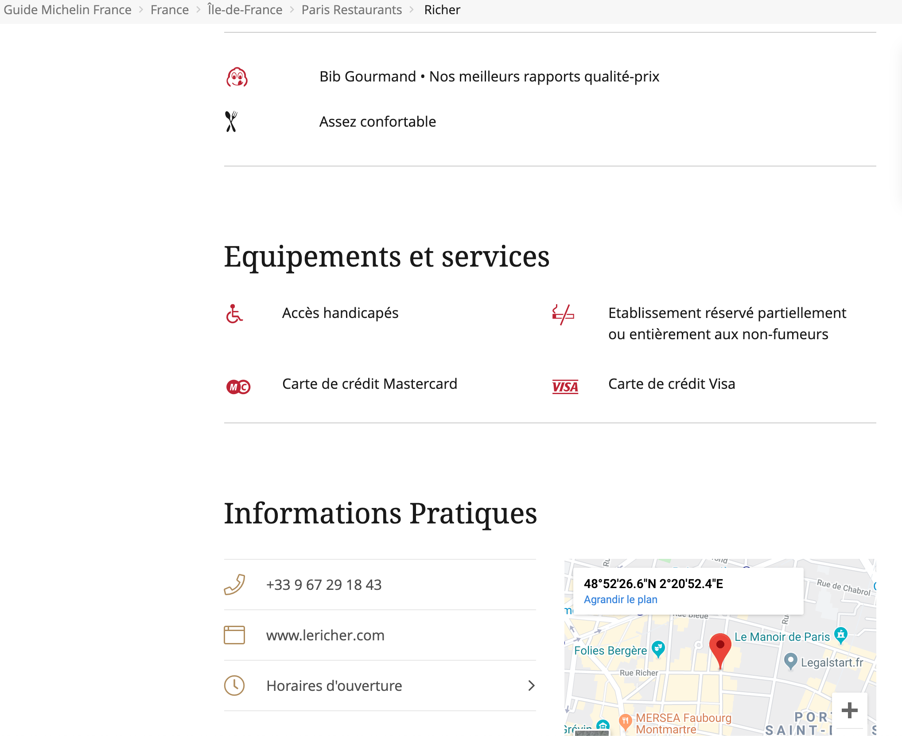
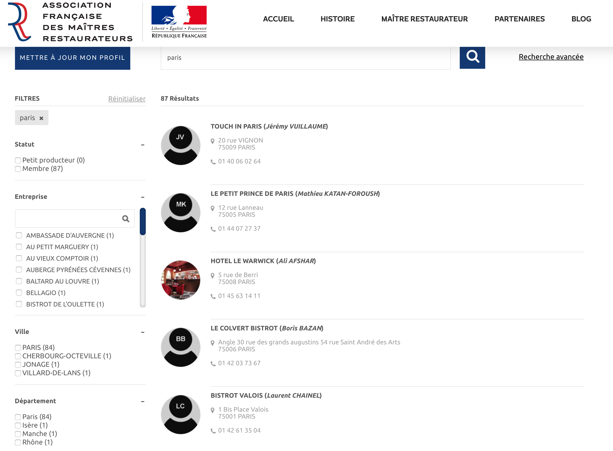
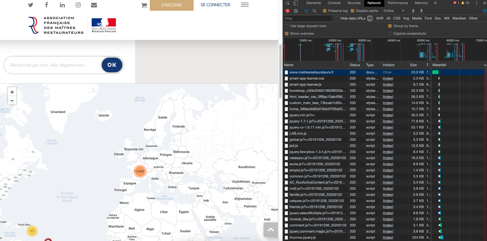
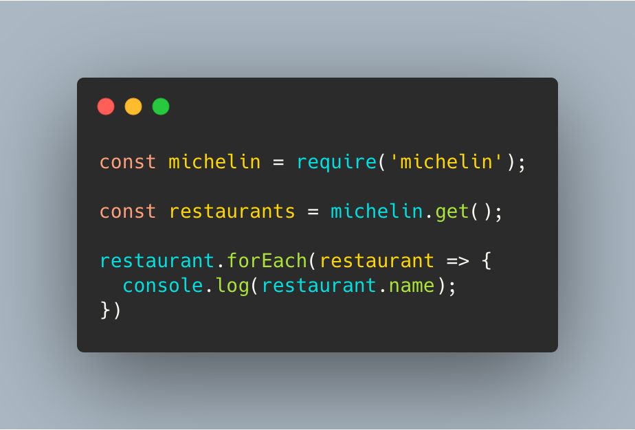
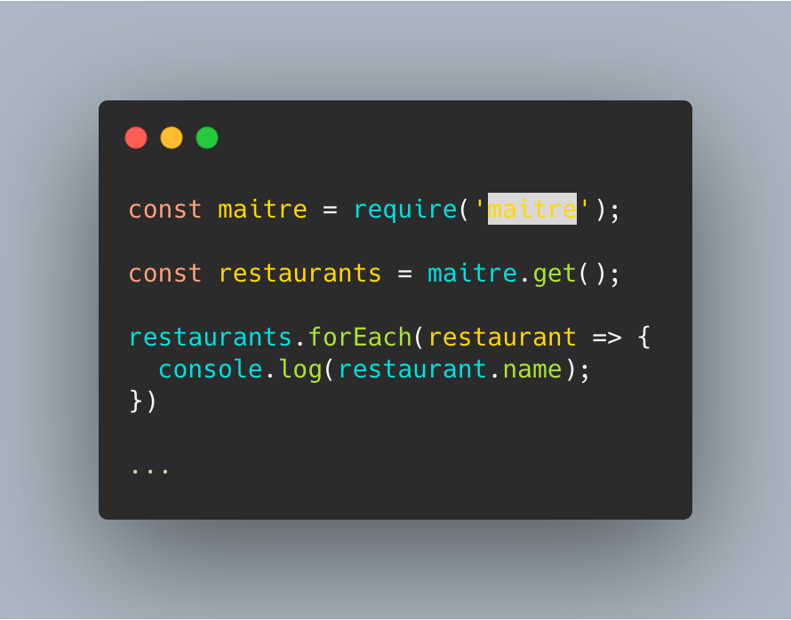
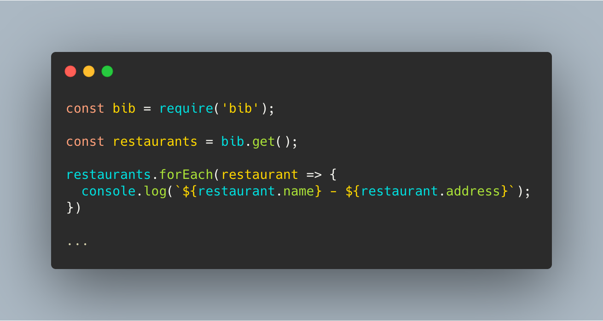

---

I've seen at least 90% of Top Chef - French version - episodes

---

25% of my monthly spending are restaurants

---

Bib Gourmand

(Michelin Distinction)

---


---

The best value for money 🍽 💳

---

entrée-plat-dessert

~ 30 euros

---

Maître Restaurateur

---


---

Le Fait Maison

_Home Made_

---
 


---



---


---



---

⏱️

Time consuming

---

Help me with a Web Application

---

🎯 List `Maître Restaurateur` with `Bib Gourmand` distinction


---

Stack

```
Node.js + React
+ JavaScript ES6
+ CSS Design Framework (bootstrap, foundation, mdl...)
[+ docker + redis ...]
```

---

Good Luck.

See you in 3 weeks.

---

🏃‍♀️ Steps to do

---

## [92bondstreet/bib](https://github.com/92bondstreet/bib)

---

Step 1. NO CODE

---

🕵️‍♀️

Investigation

---

How it works?

---

Michelin Restaurants

---

1. How it works [guide.michelin.com](https://guide.michelin.com/fr/fr/restaurants)?

---

2. How can I filter by distinction `Bib Gourmand`?

---

3. What are the properties for a `Bib Gourmand` restaurant: name, address, town, website link... ?

---

...

---


---

Maître-Restaurateur Restaurants

---

1. How it works [maitresrestaurateurs.fr](https://www.maitresrestaurateurs.fr)?

---

2. How to get the list of Restaurants?

---

3. How to identify the restaurants name?

---

...

---



---

The Web Application

---

1. How to create a connection between `Maître Restaurateur` and the `Bib Gourmand`  restaurant?

---

1. What could be useful features for the end-user?

---

⌨️

Step 2. Server-side with Node.js

---

Create a module called `michelin`

---

that return the list of restaurant with Bib Gourmand distinction

---



---

1. Scrape list of France located `Bib Gourmand` restaurants

---

1. Store the list into JSON file

---

1. Create a node module that returns the list

---

Create a module called `maitre`

---

that returns the list `Maître Restaurateur` restaurants

---



---

1. Scrape list of France located `Maitre Restaurateur` restaurants

---

1. Store the list into JSON file 

---

1. Create a node module that returns the list

---

Create a module called `bib`

---

that returns the list of `Maître Restaurateur` restaurants with `Bib Gourmand` distinction

---



---

📱

Step 3. Client-side with React

---

Later

---

MVP

---

List France located `Maître Restaurateur` with `Bib Gourmand` distinction

---

* filtering by name
* sorting by distance
* display on a map 

---

* list France located `Maître Restaurateur` with `stars` distinction
...

---

👩‍💻 Just tell me what to do

---

* Fork the project via `github`

---

* Clone the project

---

* Commit early, commit often, push often
